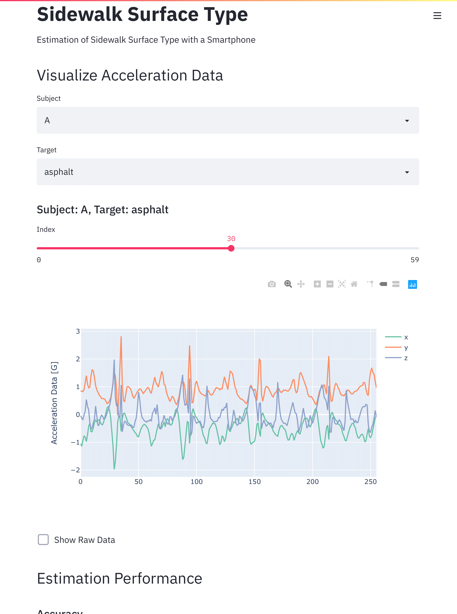

# Streamlit-sidewalk-surface-type

This is a dashboard of "Estimation of Sidewalk Surface Type with a Smartphone" by using [Streamlit](https://www.streamlit.io)



## Usage
```bash
$ streamlit run sidewalk.py
```

## Requirements
- `streamlit 0.60.0`
- `plotly 4.8.1`
- `seaborn 0.11.0`

## Contents
```
/ + sidewalk.py : main
  |
  + utils/ +
  |        |
  |        + data.py : loading data
  |        |
  |        + plotly_utils.py : utilities of plotly
  |        |
  |        + utils.py : utilities of streamlit
  + materials/ +
               |
               + cache/ : directory for sensor data
               |
               + result/ : directory for results of machine learning
```

## How to Share Streamlit Apps Securely by ContainDS
Streamlit App can be shared using Heroku, Azure, and AWS, but it is open to everyone.

If you want to reproduce it locally, it is not appropriate to have pip or conda install the library for you.

Containerisation is a great approach to this reproducibility problem. Again, you don’t want to leave your client with a list of command-line instructions. ContainDS is user-friendly software for running reproducible environments with a graphical user interface.

See [here](https://towardsdatascience.com/sharing-streamlit-apps-securely-with-your-clients-a34bf0f9e00c) for instructions on how to install ContainDS and how to get Streamlit to work with ContainDS.